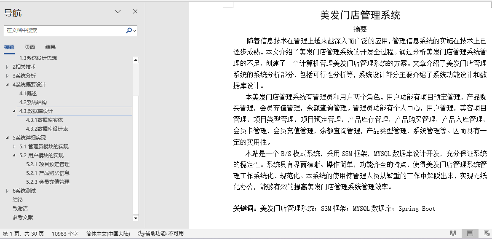
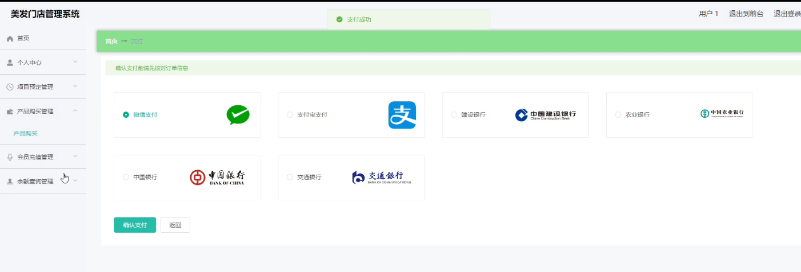
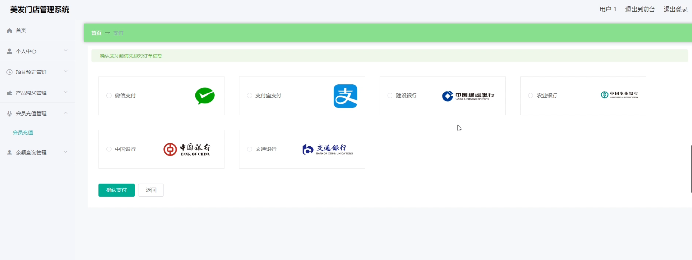
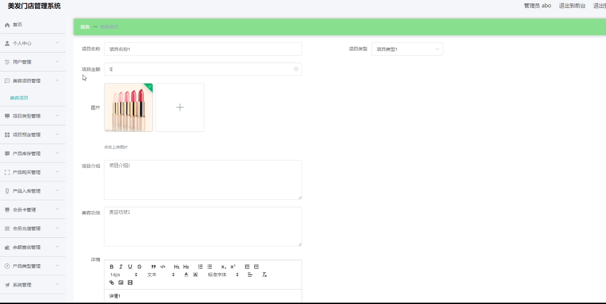
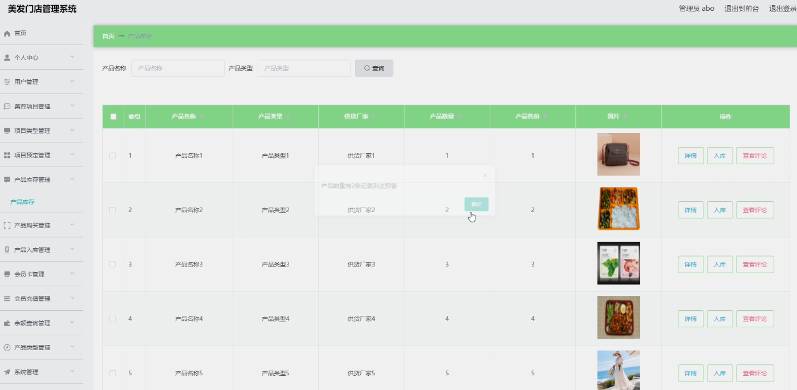
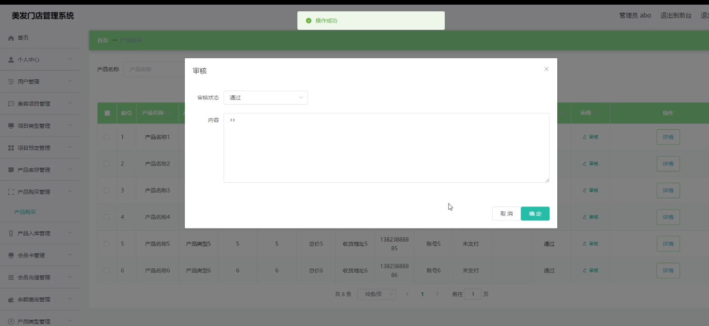
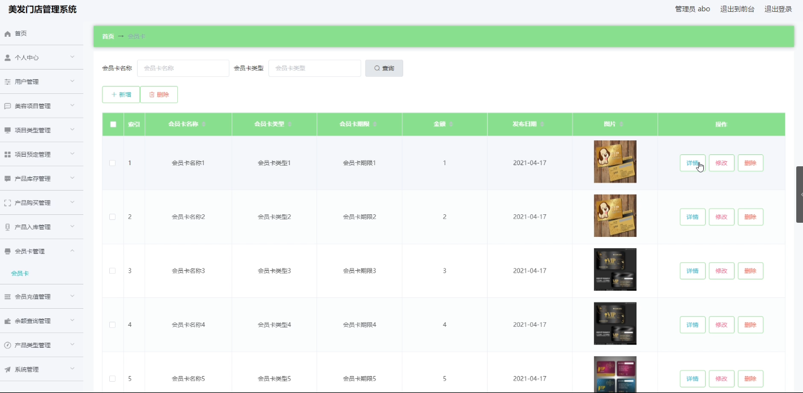
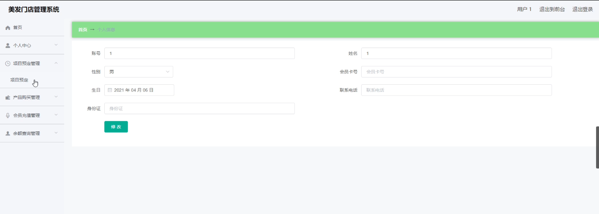

## 基于vue的美发门店管理系统(程序+报告)

###  获取sql数据库文件: 从戎源码网 (https://armycodes.com/) QQ: 386869957 QQ群: 377586148
###  所有系统地址: (https://github.com/YuLin-Coder/AllProjectCatalog) 
###  所有项目以及源代码本人均调试运行无问题 可支持远程安装部署调试、定制修改、代码讲解

## 项目介绍
基于vue的美发门店管理系统，系统包含两种角色：用户、管理员，系统分为前台和后台两大模块，主要功能如下：

1 管理员模块的实现
- 美容项目管理: 管理美容项目的添加、修改、删除及查询操作。
- 产品库存管理: 查看、修改、删除及查询产品库存信息。
- 产品购买管理: 审核产品购买信息。
- 会员卡管理: 管理会员卡的信息，包括添加、修改、删除及查询操作。

2用户模块的实现
- 项目预定管理: 用户可以进行项目预定操作。
- 产品购买信息: 用户可以进行产品购买及支付操作。
- 会员充值管理: 用户可以进行会员充值操作。

## 项目技术
- 编程语言：Java
- 数据库：MySQL
- 项目管理工具：Maven
- 前端技术：HTML、CSS、JavaScript、Vue
- 后端技术：Spring、SpringMVC、MyBatis

## 运行环境
- JDK版本：JDK1.8及以上
- 开发工具：IDEA、Ecplise、Myecplise都可以
- 数据库: MySQL5.7及以上
- Maven：maven3.0及以上
- Node：14.14.0及以上

## 运行截图

